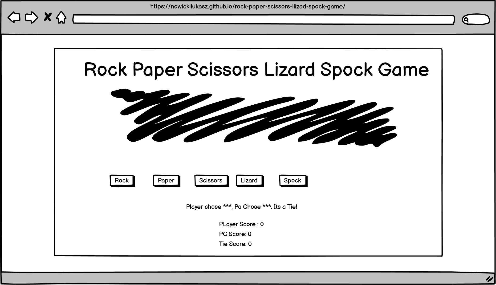

- [Live Link](https://nowickilukasz.github.io/rock-paper-scissors-llizad-spock-game/)
- [Repository](https://github.com/NowickiLukasz/rock-paper-scissors-llizad-spock-game)


# Rock, Paper, Scissors, Lizard, Spock Game

## Table of content

1. [User Experience](#user-experience)
    - [User stories](#user-stories)
    - [Design](#design)
    - [Wireframe](#wireframe)
2. [Features](#features)
3. [Technologies Used](#techonologies-used)
    - [Language Used](#languages-used)
    - [Programs Used](#programs-used)
4. [Testing](#testing)
    - [Further Testing](#further-testing)
    - [Bugs](#bugs)
5. [Depoyment](#deployment)
    - [GitHub Pages](#github-pages)
    - [Forking the GitHub Repository](#forking-the-github-repository)
    - [Making a Local Clone](#making-a-local-clone)
6. [Credits](#credits)
    - [Code](#code)

## User Experience 

### User Stories 

- First Time Visitor 
    - As a first time visitor, I want to easily understand the purpose of the site.
    - As a first time visitor, I want to be able to navigate the site with ease
    - As a first time visitor, I want to be able to understand the rules of the game. 
    - As a first time visitor, I want to see the score of the game and how the game was won.
    - As a first time visitor, I want to be able to restart the game at anytime.
    - As a first time visitor, I want to be able to see who won the round.


- Returning Visitor
    - As a returning visitor, I want to be reminded about the game rules.
    - As a returning visitor I want to be able to start the game with a score of 0.
    - As a returning visitor, I want to be able to see who won the round.

### Design 
- Color Scheme
    - The site has 3 distinct colors:
    - Body background :  #faebd7
    - Game container background: #d8bfd8
    - Button background: #ffa500


- Typography
    - The Ubuntu Mono font is the main font used throught the game, with a monospace font used as a fallback. The Ubuntu Mono feels a little bit robotic to emulates how the game operates. 

### WireFrame 
<details>
    <summary>WireFrame</summary>
    
</details>


# Features 

- Responsive on all devices

- Interactive Elements

# Techonologies Used 

## Languages Used 

- HTML
- CSS
- JavaScript

## Programs Used 

- Google Fonts:
    - Google fonts were used to import the 'Ubuntu Mono' font into the style.css file which is used in the project.

- Git
    - Git was used for version control by utilizing the Gitpod terminal to commit to Git and Push to GitHub.

- Git Hub
    - GitHub is used to store the projects code after being pushed from Git.

- Balsamiq
    - Balsamiq is an app used to create wireframes to aid with the design process. 

# Testing 

- First time Visitor
    1. As a first time visitor, I want to easily understand the purpose of the site.        
        <details><summary>The game page has a clear title of what the page represents.</summary>
        </details> 
    2. As a first time visitor, I want to be able to navigate the site with ease.
         <details><summary>The site is consise with 5 buttons to control the game. </summary>
        
        </details>
    3. As a first time visitor, I want to be able to understand the rules of the game.
        <details><summary>The rules of the game are included in the body of the game. </summary>
        
        </details>
    4. As a first time visitor, I want to see the score of the game and how the game was won.
        <details><summary>Once a selection is made, the result of the game is printed on the screen.</summary>
        
        </details>
    5. As a first time visitor, I want to be able to restart the game at anytime.
        <details><summary>A reset button is functional that allows you to reset the game to a nill score.</summary>
        
        </detials>
    6. As a first time visitor, I want to be able to see who won the round.
        <details><summary>An alert pops up once a pre determined score is reached.</summary>
        
        </details>
    
- Returning Visitor
    1. As a returning visitor, I want to be reminded about the game rules.
        - The rules of the game are included in the body of the game. 
    2. As a returning visitor I want to be able to start the game with a score of 0.
        - The game always starts on "0" score once the page is loaded.
    3. As a returning visitor, I want to be able to see who won the round that was just played.
        - An alert shows up after a score of 5 points is reached and then restarts the game to a score of "0".
        
## Further Testing 
### Validation

- HTML Validation
<details><summary></summary>

</details>

- CSS validation
<details><summary></summary>

</details>

- JavaScript Validation
<details><summary></summary>

</details>

- Accessibility
<details><summary></summary>

</details>

- Performance
<details><summary></summary>

</details>

## Bugs

1. Outcome text does not hide once the game is started anew. 
    <details><summary></summary>
    
    </details>


# Deployment 

## GitHub Pages 

The project was deployed to GitHub Pages using the following steps...

1. Log in to GitHub and locate the [GitHub Repository](https://github.com/NowickiLukasz/rock-paper-scissors-llizad-spock-game)
2. At the top of the Repository (not top of page), locate the "Settings" Button on the menu.
3. Scroll down the Settings page until you locate the "GitHub Pages" Section.
4. Under "Source", click the dropdown called "None" and select "Master Branch".
5. The page will automatically refresh.
6. Scroll back down through the page to locate the now published site [in the "GitHub Pages" section.

## Forking the GitHub Repository 

By forking the GitHub Repository we make a copy of the original repository on our GitHub account to view and/or make changes without affecting the original repository by using the following steps...

1. Log in to GitHub and locate the [GitHub Repository](https://github.com/NowickiLukasz/rock-paper-scissors-llizad-spock-game)
2. At the top of the Repository (not top of page) just above the "Settings" Button on the menu, locate the "Fork" Button.
3. You should now have a copy of the original repository in your GitHub account.

## Making a Local Clone 

1. Log in to GitHub and locate the [GitHub Repository](https://github.com/NowickiLukasz/rock-paper-scissors-llizad-spock-game)
2. Under the repository name, click "Clone or download".
3. To clone the repository using HTTPS, under "Clone with HTTPS", copy the link.
4. Open Git Bash
5. Change the current working directory to the location where you want the cloned directory to be made.
6. Type `git clone`, and then paste the URL you copied in Step 3.

```
$ git clone https://github.com/YOUR-USERNAME/YOUR-REPOSITORY
```

7. Press Enter. Your local clone will be created.

```
$ git clone https://github.com/YOUR-USERNAME/YOUR-REPOSITORY
> Cloning into `CI-Clone`...
> remote: Counting objects: 10, done.
> remote: Compressing objects: 100% (8/8), done.
> remove: Total 10 (delta 1), reused 10 (delta 1)
> Unpacking objects: 100% (10/10), done.
```

# Credits 

## Code 

- [Random Array Item](https://stackoverflow.com/questions/4550505/getting-a-random-value-from-a-javascript-array)

- Incrementation of score: Was taken from the Love Maths project.

- [Unreachable code after return statement](https://developer.mozilla.org/en-US/docs/Web/JavaScript/Reference/Errors/Stmt_after_return)